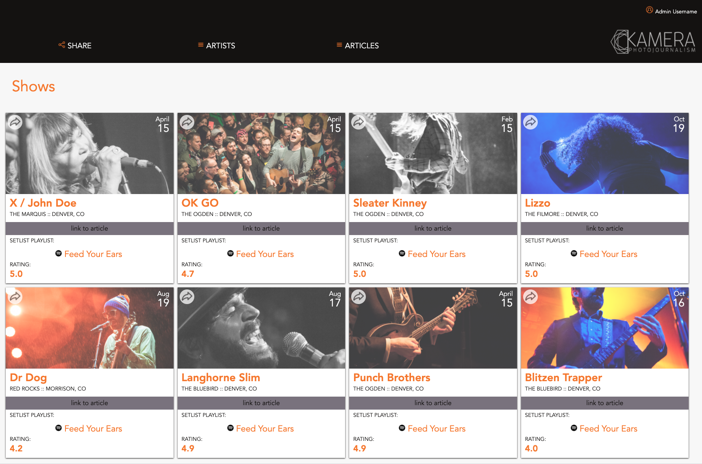
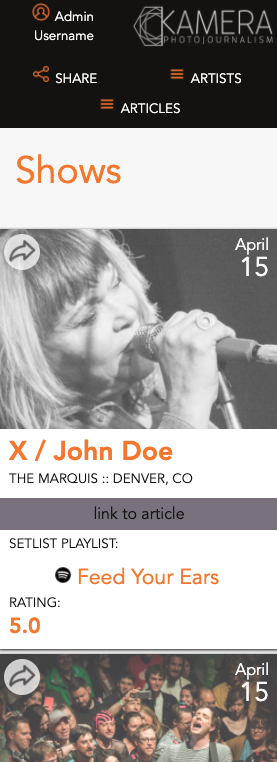

# Hang In there

### Developers
- [Kristi Miller](https://github.com/Kristiannmiller)

### Project Links
- [Repo](https://github.com/Kristiannmiller/km-comp-challenge-1.git)
- [Deployed Page](link here)

## Set-up
- Create repo and clone to personal computer
- Open in text editor
- Read the README
- In terminal, run command "open index.html" to interact with app.

## Overview & Learning Goals
For my mod 1 static comp challenge, I will recreate a webpage based off of a provided static comp image. I will have some creative liberties but the layout, spacing, and font should remain the same to the smallest detail.

I will develop my skills in HTML/CSS and get some hands on experience in building a website from the ground up.

## Progression

7/16: Created repo and respective files and directories needed to get started. Started HTML basic layout before working on a few CSS styles. Ran into issues with HTML/CSS not communicating the way I thought they would. Did some research to come back stronger tomorrow.

7/17: Created basic working structure of page header in HTML and CSS. Found and saved assets for later use. Tried some design ideas for main section of the site, but ran into some more communication issues between HTML and CSS that required more research.

7/18: Used new knowledge and ideas to finish basic structure of my HTML and CSS.

7/19: Worked through website responsiveness issues to get mobile view to work. Ran into issues with all other larger breakpoints. Cleaned and dried up code.

## Functionality Showcase

Static Comp Original Structure 
  

Static Comp Full Page View 
  

Static Comp Mobile View 
  

Project spec & rubric can be found [here](https://frontend.turing.io/projects/module-1/m1-static-comp.html)
